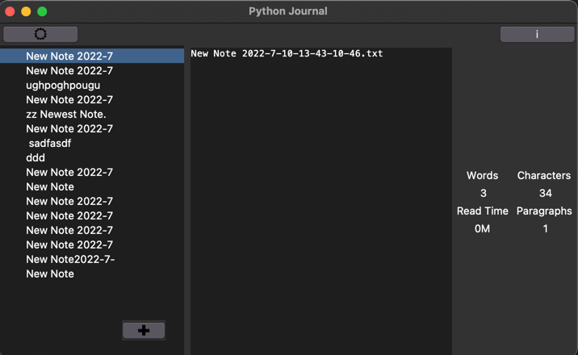
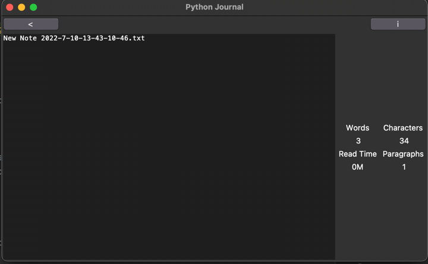

# python-journal

## Progress

## Objective

Note-taking application done using only tkinter. 

- Create new notes
- Deletes notes
- Keyboard shortcuts
- Right click pop up menus
- Updates notes

## Planned features
- Link settings to text widget
- Create ttk theme
- Markdown formatting 
- Turn info panel into hidden menu
